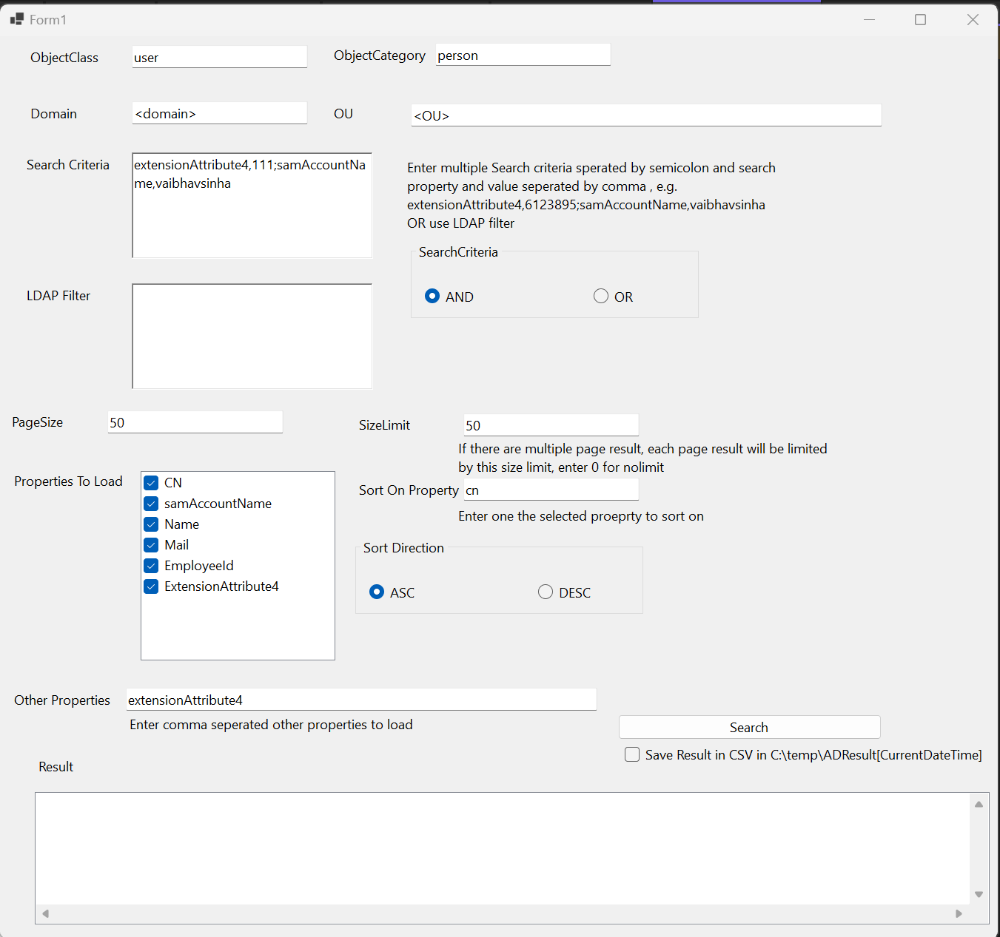

# Active Directory Search 
Some of the features :

- Enter Object Class and Category

- Enter Domain and OU

- Enter search filter criteria with OR and And conditions (OR enter your ldap filter) 

- Paging the search result with size limit 

- Sorting and Sort Direction 

- Selection for Properties to Load, or enter what ever we want to load

- See the result in screen or save in file as CSV 

 