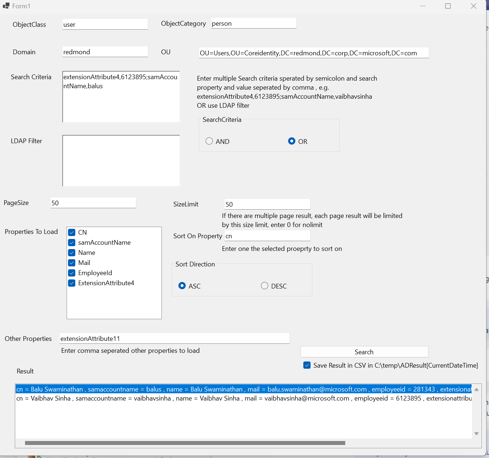

# Active Directory Search 
Some of the features :

1) Enter Object Class and Category

2) Enter search filter criteria with OR and And conditions (OR enter your ldap filter) 

3) Paging the search result with size limit 

4) Sorting and Sort Direction 

5) Selection for Properties to Load, or enter what ever we want to load

6) See the result in screen or save in file as CSV 

 